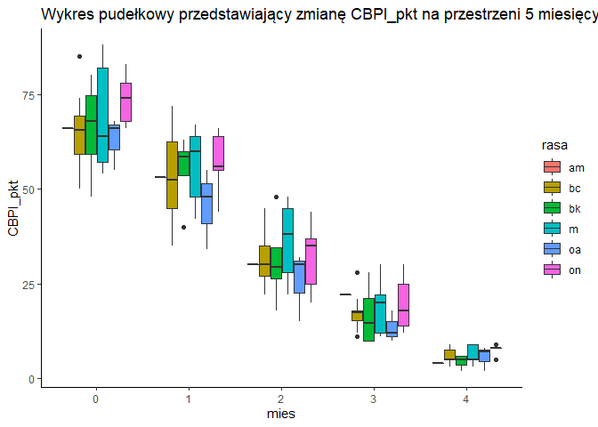

### Mateusz Sypniewski - raport zaliczeniowy


#### Poniższy raport prezentuje analizy wpływu preparatu ADMSC na spadek objawów bólowych (wyrażanych w punktowej skali: `CBPI_pkt`) u sześciu ras psów, na przestrzeni pięciu miesięcy. 

##### Wczytywanie pakietów

```r
library(readxl)
library(tidyverse)
```


#### Załadowanie tabeli:

```r
df <- read_excel('../1tabele — kopia.xlsx', sheet = 4)
```

#### Sprawdzenie struktury tabeli:

```r
glimpse(df)
```

```
## Rows: 160
## Columns: 5
## $ rasa       <chr> "border collie", "bokser", "mieszaniec", "owczarek niemi...
## $ CBPI_pkt   <dbl> 60, 73, 61, 78, 68, 59, 66, 57, 55, 88, 83, 67, 64, 66, ...
## $ objawy_usg <chr> "BDE", "ADF", "ABCEF", "BDE", "ABC", "BDE", "ABCF", "BDF...
## $ CBPI_wo    <chr> "d", "d", "d", "d", "d", "e", "d", "e", "e", "d", "e", "...
## $ mies       <dbl> 0, 0, 0, 0, 0, 0, 0, 0, 0, 0, 0, 0, 0, 0, 0, 0, 0, 0, 0,...
```
#### Tabela składa się z 160 obserwacji oraz 5 kolumn:

* `rasa`: rasy badanych psów
* `CBPI_pkt`: właścicielska ocena bólu wg. skali Canine Brief Pain Inventor - PennCHART (CBPI), wykonywanąa przez opiekunów psów
* `objawy_usg` : objawy usg (więcej nie rozumiem z tego)
* `CBPI_wo`: ocena komfortu życia psa w skali:  a – doskonała, b - bardzo dobra, c – dobra, d – słaba, e – zła 
* `mies`: miesiąc pomiaru

#### Rasy psów w badaniu:

```r
unique(df$rasa)
```

```
## [1] "border collie"         "bokser"                "mieszaniec"           
## [4] "owczarek niemiecki"    "owczarek australijski" "amstaff"
```

#### Dla ułatwienia analiz koduję poszczególne rasy

```r
df$rasa[df$rasa == 'border collie'] <- 'bc'
df$rasa[df$rasa == 'bokser'] <- 'bk'
df$rasa[df$rasa == 'mieszaniec'] <- 'm'
df$rasa[df$rasa == 'owczarek niemiecki'] <- 'on'
df$rasa[df$rasa == 'owczarek australijski'] <- 'oa'
df$rasa[df$rasa == 'amstaff'] <- 'am'
unique(df$rasa)
```

```
## [1] "bc" "bk" "m"  "on" "oa" "am"
```

#### Konwertuję pozostałe kolumny na czynniki grupujące

```r
df$rasa <- as.factor(df$rasa)
df$objawy_usg <- as.factor(df$objawy_usg)
df$CBPI_wo <- as.factor(df$CBPI_wo)
df$mies <- as.factor(df$mies)
```

#### Sprawdzam całkowitą liczbę obserwacji dla każdej rasy

```r
df.rasa <- df %>% group_by(rasa) %>% summarise(n=n())
```

```
## `summarise()` ungrouping output (override with `.groups` argument)
```

```r
df.rasa
```

```
## # A tibble: 6 x 2
##   rasa      n
##   <fct> <int>
## 1 am        5
## 2 bc       50
## 3 bk       20
## 4 m        45
## 5 oa       15
## 6 on       25
```


```r
df %>% ggplot(aes(x=mies,y=CBPI_pkt, fill=rasa)) + geom_boxplot() + theme_classic() + ggtitle('Wykres pudełkowy przedstawiający zmianę CBPI_pkt na przestrzeni 5 miesięcy')
```

<!-- -->

#### Ocena zależności pomiędzy upływem czasu (`mies`), a spadkiem nasilenia objawów bólowych (`CBPI_pkt`) została przeanalizowana z użyciem modelu mieszanego, gdzie `rasa` została ujęta jako efekt losowy


```r
library(lmerTest)
```


```
## Linear mixed model fit by REML. t-tests use Satterthwaite's method [
## lmerModLmerTest]
## Formula: CBPI_pkt ~ mies + rasa + (1 | rasa)
##    Data: df
## 
## REML criterion at convergence: 1083.1
## 
## Scaled residuals: 
##      Min       1Q   Median       3Q      Max 
## -2.28167 -0.55878 -0.02644  0.57092  2.37119 
## 
## Random effects:
##  Groups   Name        Variance Std.Dev.
##  rasa     (Intercept)  0.4822  0.6944  
##  Residual             65.3422  8.0834  
## Number of obs: 160, groups:  rasa, 6
## 
## Fixed effects:
##             Estimate Std. Error      df t value Pr(>|t|)    
## (Intercept)   66.744      3.897 150.000  17.128  < 2e-16 ***
## mies1        -13.062      2.021 150.000  -6.464 1.35e-09 ***
## mies2        -34.969      2.021 150.000 -17.304  < 2e-16 ***
## mies3        -49.438      2.021 150.000 -24.464  < 2e-16 ***
## mies4        -61.250      2.021 150.000 -30.309  < 2e-16 ***
## rasabc        -0.280      3.917 150.000  -0.071    0.943    
## rasabk        -0.300      4.159 150.000  -0.072    0.943    
## rasam          2.089      3.935 150.000   0.531    0.596    
## rasaoa        -4.333      4.288 150.000  -1.011    0.314    
## rasaon         3.080      4.080 150.000   0.755    0.451    
## ---
## Signif. codes:  0 '***' 0.001 '**' 0.01 '*' 0.05 '.' 0.1 ' ' 1
## 
## Correlation of Fixed Effects:
##        (Intr) mies1  mies2  mies3  mies4  rasabc rasabk rasam  rasaoa
## mies1  -0.259                                                        
## mies2  -0.259  0.500                                                 
## mies3  -0.259  0.500  0.500                                          
## mies4  -0.259  0.500  0.500  0.500                                   
## rasabc -0.888  0.000  0.000  0.000  0.000                            
## rasabk -0.836  0.000  0.000  0.000  0.000  0.832                     
## rasam  -0.884  0.000  0.000  0.000  0.000  0.879  0.828              
## rasaoa -0.811  0.000  0.000  0.000  0.000  0.807  0.760  0.803       
## rasaon -0.852  0.000  0.000  0.000  0.000  0.848  0.799  0.844  0.774
```

#### Wyniki i wnioski

* Współczynniki regresji dla poszczególnych miesięcy są istotne statystycznie $(p-value < 0.05)$. Oznacza to, że spadek nasilenia objawów bólowych na przestrzeni pięciu miesięcy jest istotny statystycznie

* Współczynniki regresji dla poszczególnych ras są nieistotne statystycznie $(p-value > 0.05)$. Oznacza to, że rasa psa nie ma wpływu na zmianę w nasileniu objawów bólowych

